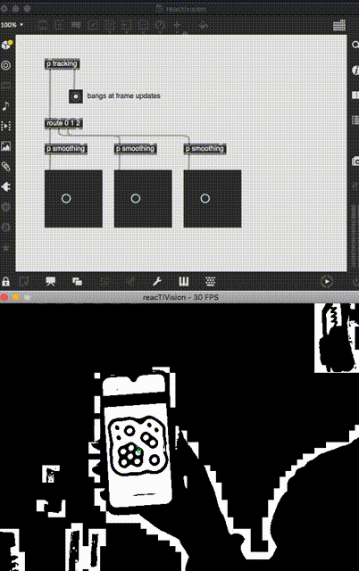

The Max patch `reactivsion.maxpat` is a standalone Max patch that functions as a middleware between the `[TUIOClient]` that comes with the Max client download from [the reacTIVision source](http://reactivision.sourceforge.net/).

To use it, download the support [reacTIVision vision engine](http://reactivision.sourceforge.net/) for your operating system. By opening the vision engine and `reactivision.maxpat`, you should be able to reproduce the same as is shown in the GIF below. The full set of fiducial markers that are available to use can be found [here](http://reactivision.sourceforge.net/data/fiducials.pdf).

